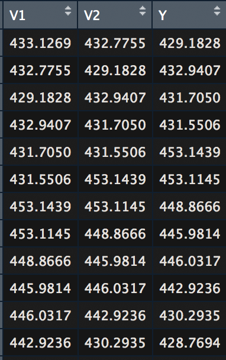

```{r setup, include=FALSE,message=FALSE}
knitr::opts_chunk$set(echo = TRUE)
```


#data prep
##This is the data preprocessing code.
```{r}
library(tidyverse)
library(kernlab)
library(anytime)
library(rlist)
#get data
data <- read.csv("bitstampUSD_1-min_data_2012-01-01_to_2018-03-27.csv")
alldata <- data.frame(data)
#this is tbe original data
tail(alldata)
alldata$date <- anydate(data$Timestamp)

dailyprice <- aggregate(alldata$Weighted_Price, list(alldata$date), mean)
write.csv(x = dailyprice,file = "shorter.csv",row.names=FALSE)
dailyprice <- read.csv("shorter.csv")
#this is the processed data
tail(dailyprice)


#split test and train
train_begin <- c("2016-01-01")
train_end <- c("2018-01-25")
test_begin <- c("2018-02-26")
test_end <- c("2018-03-26")

train_begin_date <- as.Date(train_begin)
train_end_date <- as.Date(train_end)
test_begin_date <- as.Date(test_begin)
test_end_date <- as.Date(test_end)

alldays <- as.numeric(test_end_date-train_begin_date)

#function help process lookback data
create_lookback <- function(dataframe, lookback){
  list1 <- list()
  list2 <- list()
  for (i in c(1:(length(dataframe)-lookback))){
    a <- list(dataframe[i:((i+lookback)-1)])
    list1[length(list1)+1] <- a
    #list.append(list1,X=c(a))
    #print(list1)
    b <- dataframe[i+lookback]
    list2[length(list2)+1] <- b

  }
  
  df <- as.data.frame(t(as.data.frame(list1))) 
  #print(df)
  df$Y <- unlist(list2)
  return(df)
}


traindays <- as.numeric(train_end_date-train_begin_date)
traindays
testdays <- as.numeric(test_end_date-test_begin_date)
testdays


lookback <- 2
traindata <- dailyprice[(nrow(dailyprice)-alldays):(nrow(dailyprice)-alldays+traindays),]
df_train <- create_lookback(traindata$x,lookback)
#names(df_train)[1] <- c("Y")
testdata <- dailyprice[(nrow(dailyprice)-testdays):(nrow(dailyprice)),]
df_test <- create_lookback(testdata$x,lookback)
testdata <- testdata[(lookback+1):nrow(testdata),]
#names(df_test)[1] <- c("Y")
train_test_data <- dailyprice[(nrow(dailyprice)-alldays):(nrow(dailyprice)),]
#df_all <- create_lookback(train_test_data$x,lookback)
```
##The data is downloaded from a kaggle challenge It contains price data and date from 2011 to 2018 of bitcoin. I already preprocess the data and split those into test and train data. I only selected 2016-01-01 to2018-01-25 as trianing data. 2018-01-26 to 2018-03-26 as test data. I created a lookback function.Lookback is the number of days of the prices you want it to be the factors to predict the current day's price. if the look back is set to 2, it means that one day's price will have previous two days' price as X for training to predict the price of that day. A picture of lookback=2 is shown in figure 1





##For the graphs, black points are the training data, blue points are the testing data true values, red line connects the predicted prices. The mean square error of each model can show the how good the model is. There are definitely more and better models to do this. Also there can be more factors to be concerned to predict the price. As far as I know, LSTM is a better choice in deep learning to do a forcasting in time series. 
```{r}
#lm_fit <- lm(Weighted_Price~.,traindata)
lm_fit <- lm(Y~.,df_train)
lm_fit
lm_predictions <- predict(lm_fit, df_test)
mse <- mean((testdata$x - lm_predictions)^2)
print(mse)
prediction_data <- tail(testdata,length(lm_predictions))
ggplot()+geom_point(data = traindata,aes(x=traindata$Group.1,y=traindata$x),color="black")+geom_point(data=testdata,aes(x=testdata$Group.1,y=testdata$x),color="blue")+geom_line(aes(x=prediction_data$Group.1,y = lm_predictions,group=1),color="red")


```


#SVMModel
```{r, echo=FALSE}
#svm_fit <- ksvm(Weighted_Price~.,traindata, kernel = "rbfdot")
svm_fit <- ksvm(Y~.,df_train, kernel = "rbfdot")
svm_fit
#?ksvm
#df_test[,2]
svm_predictions <- predict(object = svm_fit, df_test)
#svm_predictions
svm_mse <- mean((testdata[1:length(svm_predictions),]$x - svm_predictions)^2)
print(svm_mse)

prediction_data <- tail(testdata,length(svm_predictions))
ggplot()+geom_point(data = traindata,aes(x=traindata$Group.1,y=traindata$x),color="black")+geom_point(data=testdata,aes(x=testdata$Group.1,y=testdata$x),color="blue")+geom_line(aes(x=prediction_data$Group.1,y = svm_predictions,group=1),color="red")


```


